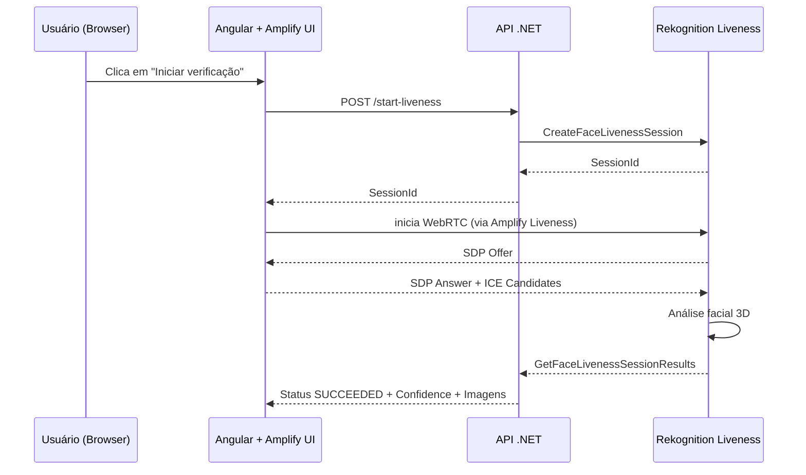

# 🔐 AWS Rekognition Face Liveness — Integração com Cognito + WebRTC (Angular + .NET)

## 📘 Objetivo

Este documento explica como integrar o **Amazon Cognito** e o **Amazon Rekognition Face Liveness** em uma aplicação **Angular + .NET**, garantindo que o fluxo **WebRTC** funcione corretamente para capturar o vídeo facial e gerar resultados reais (Confidence, Status, Decision, Audit Images).

---

## 🧠 Contexto do Problema

Mesmo com Cognito configurado, alguns projetos permanecem com o resultado:

```
Status: CREATED
Confidence: 0
Decision: UNKNOWN
```
### 💡 Causa:
O componente usado (`liveness-widget/src/widget.jsx`) é apenas um **placeholder**, que cria a sessão, mas **não inicia o streaming WebRTC real** para o Amazon Rekognition.

---

## ⚙️ Solução Oficial — Usar o Detector Real do AWS Amplify

### 1️⃣ Instalar o SDK oficial
```bash
npm install aws-amplify @aws-amplify/ui-react
```

### 2️⃣ Configurar o Amplify com o Cognito
No arquivo `main.ts` ou `app.module.ts`:

```typescript
import { Amplify } from 'aws-amplify';
import awsconfig from './aws-exports';

Amplify.configure(awsconfig);
```

> ⚠️ Essa inicialização é obrigatória antes de renderizar o componente de Liveness.

---

### 3️⃣ Importar o componente React (funcional com WebRTC)
```typescript
import '@aws-amplify/ui-react';
```

### 4️⃣ Usar o componente real
```html
<amplify-liveness-detector
  [sessionId]="sessionId"
  region="us-east-1"
  (onAnalysisComplete)="handleResult($event)">
</amplify-liveness-detector>
```

> Esse componente inicia automaticamente o fluxo WebRTC, realiza o handshake SDP/ICE e envia o vídeo para o serviço Rekognition.

---

## 🌐 Configurações obrigatórias

### HTTPS no Angular
O WebRTC exige contexto seguro para acesso à câmera:

```bash
ng serve --ssl true
```

---

### CORS do bucket S3
Defina o CORS no S3 para liberar requisições do Angular:

```json
[
  {
    "AllowedHeaders": ["*"],
    "AllowedMethods": ["GET", "PUT", "POST", "DELETE"],
    "AllowedOrigins": ["https://localhost:4200", "https://seu-dominio-app"],
    "ExposeHeaders": ["ETag"]
  }
]
```

---

### IAM Policy (mínima para Liveness)
```json
{
  "Version": "2012-10-17",
  "Statement": [
    {
      "Effect": "Allow",
      "Action": [
        "rekognition:CreateFaceLivenessSession",
        "rekognition:GetFaceLivenessSessionResults"
      ],
      "Resource": "*"
    }
  ]
}
```

---

## 🧩 Sequência Completa do Fluxo Cognito + Liveness



---

## 🧾 Checklist de Diagnóstico

| Verificação | Resultado Esperado | Correção |
|--------------|-------------------|-----------|
| Amplify configurado antes do componente | ✅ | Inicializar Amplify antes do AppModule |
| HTTPS ativo | ✅ | `ng serve --ssl true` |
| Cognito configurado corretamente | ✅ | Tokens válidos e domínio autorizado |
| CORS configurado no S3 | ✅ | Permitir `localhost` e domínio da aplicação |
| Sessão recriada após 3min | ✅ | Regenerar `SessionId` automaticamente |
| Widget placeholder removido | ✅ | Substituir por `@aws-amplify/ui-react` |
| ICE candidates enviados | ✅ | Verifique no console WebRTC log |

---

## ✅ Logs esperados (API .NET)

```log
Face Liveness results processed.
SessionId: 15b9ad8d-0123-4015-8d6b-fbff20203929
Confidence: 87.41
Status: SUCCEEDED
Decision: LIVE
```

---

## 📁 Resultado Esperado no S3

- `/liveness/ref_<sessionId>.jpg`
- `/liveness/audit_1.jpg`
- `/liveness/audit_2.jpg`

---

## 📚 Fontes Oficiais AWS

- [Detecting face liveness](https://docs.aws.amazon.com/rekognition/latest/dg/face-liveness.html)
- [Programming API reference](https://docs.aws.amazon.com/rekognition/latest/dg/face-liveness-programming-api.html)
- [Amplify Liveness blog (Cognito integration)](https://aws.amazon.com/blogs/mobile/detect-real-users-with-aws-amplify-and-face-liveness/)
- [Requisitos e limitações do WebRTC](https://docs.aws.amazon.com/rekognition/latest/dg/face-liveness-requirements.html)

---

## ✅ Resumo Final

| Ação | Status | Descrição |
|-------|---------|-----------|
| Configurar Amplify com Cognito | 🔧 | Autenticação + inicialização obrigatória |
| Usar `<amplify-liveness-detector>` | ✅ | WebRTC ativo e envio de vídeo |
| Ativar HTTPS local | ✅ | Necessário para `getUserMedia()` |
| Corrigir CORS S3 | ✅ | Liberação de origem e headers |
| Verificar logs AWS | 🔍 | Deve retornar `SUCCEEDED` |

---

**Autor:** Raphael Dutra  
**Projeto:** DayFusion — AWS Liveness + Cognito + WebRTC  
**Última atualização:** 03/11/2025  
**Fonte:** Documentação oficial AWS Rekognition & Amplify
