# DayFusion – Novo Menu + Fluxo de Verificação (Widget AWS + Modal Custom)

> Arquivo pensado para Angular 16+ / 19, usando **Standalone Components**.  
> Ajuste nomes de pastas conforme seu projeto.

---

## 1. Objetivo do Fluxo

1. Criar **novo menu** (layout renovado) para o DayFusion.
2. Abrir o **Widget AWS Face Liveness dentro de um modal**.
3. Após o término do Liveness, **continuar no mesmo modal** com uma etapa customizada (review, match, observações, etc.).  
4. Evitar problemas de câmera / WebRTC ao **não ficar abrindo e fechando múltiplos modais**.

Fluxo alto nível:

```mermaid
flowchart LR
  A[Menu: Widget AWS] --> B[Modal Verificação Facial]
  B -->|Etapa 1| C[Widget AWS Liveness]
  C -->|Sucesso| D[Etapa 2 - Modal Custom]
  D -->|Confirmar / Rejeitar| E[Salvar & Fechar Modal]
```



---

## 2. Estrutura de Pastas Sugerida

```bash
src/app/
  core/
    services/
      aws-liveness.service.ts
  layout/
    sidebar/
      sidebar.component.ts
      sidebar.component.html
      sidebar.component.scss
  features/
    face-verification/
      face-verification-flow.component.ts
      face-verification-flow.component.html
      face-verification-flow.component.scss

      steps/
        aws-liveness-step/
          aws-liveness-step.component.ts
          aws-liveness-step.component.html
          aws-liveness-step.component.scss

        custom-review-step/
          custom-review-step.component.ts
          custom-review-step.component.html
          custom-review-step.component.scss
```

---

## 3. Novo Menu Lateral (Sidebar)

### 3.1. `sidebar.component.ts`

```ts
import { Component, Input } from '@angular/core';
import { Router } from '@angular/router';
import { NgClass, NgFor, NgIf } from '@angular/common';

interface MenuItem {
  label: string;
  icon?: string;
  route?: string;
  active?: boolean;
  badge?: string;
}

@Component({
  selector: 'app-sidebar',
  standalone: true,
  imports: [NgFor, NgIf, NgClass],
  templateUrl: './sidebar.component.html',
  styleUrls: ['./sidebar.component.scss']
})
export class SidebarComponent {
  @Input() collapsed = false;

  menuItems: MenuItem[] = [
    { label: 'Dashboard', route: '/dashboard', icon: 'ph ph-gauge' },
    { label: 'Apresentação', route: '/presentation', icon: 'ph ph-monitor-play' },
    { label: 'Captura 3D', route: '/capture-3d', icon: 'ph ph-cube-focus' },
    { label: 'Widget AWS', route: '/face-verification', icon: 'ph ph-shield-check' },
    { label: 'Histórico', route: '/history', icon: 'ph ph-clock-counter-clockwise' },
    { label: 'Observações', route: '/notes', icon: 'ph ph-note-pencil' },
    { label: 'Configurações', route: '/settings', icon: 'ph ph-gear' },
    { label: 'Logs', route: '/logs', icon: 'ph ph-activity' },
    { label: 'Ajuda', route: '/help', icon: 'ph ph-question' }
  ];

  constructor(private router: Router) {}

  navigate(item: MenuItem) {
    if (!item.route) return;
    this.router.navigate([item.route]);
  }

  isActive(item: MenuItem): boolean {
    if (!item.route) return false;
    return this.router.url.startsWith(item.route);
  }
}
```

---

### 3.2. `sidebar.component.html`

```html
<div class="sidebar" [ngClass]="{ 'sidebar--collapsed': collapsed }">
  <div class="sidebar__logo">
    <div class="sidebar__logo-mark">DF</div>
    <div class="sidebar__logo-text" *ngIf="!collapsed">
      <div class="sidebar__logo-title">DayFusion</div>
      <div class="sidebar__logo-subtitle">Reconhecimento Facial</div>
    </div>
  </div>

  <nav class="sidebar__nav">
    <button
      class="sidebar__item"
      *ngFor="let item of menuItems"
      [ngClass]="{ 'sidebar__item--active': isActive(item) }"
      (click)="navigate(item)">

      <i class="sidebar__icon" [ngClass]="item.icon"></i>
      <span class="sidebar__label" *ngIf="!collapsed">
        {{ item.label }}
      </span>

      <span class="sidebar__badge" *ngIf="item.badge && !collapsed">
        {{ item.badge }}
      </span>
    </button>
  </nav>

  <div class="sidebar__footer" *ngIf="!collapsed">
    <div class="sidebar__user">
      
      <div>
        <div class="sidebar__user-name">Raphael Dutra</div>
        <div class="sidebar__user-id">227.101.058-61</div>
      </div>
    </div>
  </div>
</div>
```

---

### 3.3. `sidebar.component.scss`

```scss
.sidebar {
  width: 260px;
  min-height: 100vh;
  background: radial-gradient(circle at top, #141b33 0, #050816 45%, #02010c 100%);
  border-right: 1px solid rgba(255, 255, 255, 0.04);
  padding: 1.5rem 1.25rem;
  display: flex;
  flex-direction: column;
  gap: 1.5rem;
  color: #f5f7ff;
  box-shadow: 0 0 40px rgba(0, 0, 0, 0.7);
  backdrop-filter: blur(18px);

  &--collapsed {
    width: 90px;
    .sidebar__logo-text,
    .sidebar__label,
    .sidebar__footer {
      display: none;
    }
  }

  &__logo {
    display: flex;
    align-items: center;
    gap: 0.75rem;
    padding: 0.25rem 0.5rem;
  }

  &__logo-mark {
    width: 40px;
    height: 40px;
    border-radius: 14px;
    background: radial-gradient(circle at 30% 0, #48b5ff, #5a3dff 40%, #ff3fa4 100%);
    display: flex;
    align-items: center;
    justify-content: center;
    font-weight: 700;
    letter-spacing: 1px;
    font-size: 1.1rem;
    box-shadow:
      0 0 18px rgba(90, 61, 255, 0.7),
      0 0 25px rgba(72, 181, 255, 0.5);
  }

  &__logo-title {
    font-weight: 700;
    font-size: 1.15rem;
  }

  &__logo-subtitle {
    font-size: 0.75rem;
    opacity: 0.7;
  }

  &__nav {
    display: flex;
    flex-direction: column;
    gap: 0.35rem;
    margin-top: 0.75rem;
  }

  &__item {
    border: none;
    outline: none;
    background: transparent;
    color: inherit;
    display: flex;
    align-items: center;
    gap: 0.75rem;
    padding: 0.55rem 0.75rem;
    border-radius: 999px;
    cursor: pointer;
    font-size: 0.92rem;
    position: relative;
    transition:
      background 0.18s ease,
      transform 0.12s ease,
      box-shadow 0.18s ease;

    &:hover {
      background: rgba(120, 131, 255, 0.18);
      transform: translateX(1px);
      box-shadow: 0 0 16px rgba(83, 109, 254, 0.35);
    }

    &--active {
      background: linear-gradient(90deg, #4169ff, #7b5cff);
      box-shadow:
        0 0 22px rgba(83, 109, 254, 0.7),
        0 0 30px rgba(123, 92, 255, 0.6);

      .sidebar__label {
        font-weight: 600;
      }

      .sidebar__icon {
        filter: drop-shadow(0 0 10px rgba(0, 0, 0, 0.7));
      }
    }
  }

  &__icon {
    font-size: 1.2rem;
    width: 1.8rem;
    display: flex;
    justify-content: center;
  }

  &__label {
    flex: 1;
    text-align: left;
  }

  &__badge {
    background: rgba(255, 255, 255, 0.08);
    padding: 0.1rem 0.5rem;
    border-radius: 999px;
    font-size: 0.7rem;
    letter-spacing: 0.05em;
    text-transform: uppercase;
  }

  &__footer {
    margin-top: auto;
  }

  &__user {
    display: flex;
    align-items: center;
    gap: 0.75rem;
    padding: 0.6rem 0.7rem;
    border-radius: 1rem;
    background: rgba(15, 23, 42, 0.7);
    border: 1px solid rgba(148, 163, 253, 0.35);
    box-shadow: 0 0 18px rgba(15, 23, 42, 0.7);
  }

  &__avatar {
    width: 40px;
    height: 40px;
    border-radius: 999px;
    object-fit: cover;
    border: 1px solid rgba(96, 165, 250, 0.8);
  }

  &__user-name {
    font-size: 0.9rem;
    font-weight: 600;
  }

  &__user-id {
    font-size: 0.7rem;
    opacity: 0.7;
  }
}
```

---

## 4. Rota para o Novo Fluxo de Verificação

```ts
import { Routes } from '@angular/router';
import { FaceVerificationFlowComponent } from './features/face-verification/face-verification-flow.component';

export const routes: Routes = [
  // outras rotas...
  {
    path: 'face-verification',
    component: FaceVerificationFlowComponent
  }
];
```

---

## 5. Componente Principal do Fluxo (Modal Único com Etapas)

```ts
// face-verification-flow.component.ts
import { Component } from '@angular/core';
import { NgIf } from '@angular/common';
import { AwsLivenessStepComponent } from './steps/aws-liveness-step/aws-liveness-step.component';
import { CustomReviewStepComponent } from './steps/custom-review-step/custom-review-step.component';

export interface LivenessResult {
  sessionId: string;
  confidenceScore: number;
  fraudScore?: number;
  mediaBucket?: string;
  mediaKey?: string;
  raw?: any;
}

@Component({
  selector: 'app-face-verification-flow',
  standalone: true,
  imports: [NgIf, AwsLivenessStepComponent, CustomReviewStepComponent],
  templateUrl: './face-verification-flow.component.html',
  styleUrls: ['./face-verification-flow.component.scss']
})
export class FaceVerificationFlowComponent {
  showModal = false;
  step: 1 | 2 = 1;
  livenessResult?: LivenessResult;

  openFlow() {
    this.showModal = true;
    this.step = 1;
    this.livenessResult = undefined;
  }

  closeFlow() {
    this.showModal = false;
  }

  onLivenessCompleted(result: LivenessResult) {
    this.livenessResult = result;
    this.step = 2;
  }

  onReviewFinished() {
    this.closeFlow();
  }
}
```

```html
<!-- face-verification-flow.component.html -->
<div class="page">
  <div class="page__header">
    <div>
      <h1>Widget AWS Face Liveness</h1>
      <p>Verificação facial com prova de vida 3D + etapa customizada DayFusion.</p>
    </div>

    <button class="btn-primary" (click)="openFlow()">
      🚀 Iniciar Verificação
    </button>
  </div>

  <div class="modal-backdrop" *ngIf="showModal">
    <div class="modal">
      <div class="modal__header">
        <h2 *ngIf="step === 1">Etapa 1: Prova de Vida AWS</h2>
        <h2 *ngIf="step === 2">Etapa 2: Revisão e Match DayFusion</h2>

        <button class="modal__close" (click)="closeFlow()">✕</button>
      </div>

      <div class="modal__body">
        <app-aws-liveness-step
          *ngIf="step === 1"
          (completed)="onLivenessCompleted($event)">
        </app-aws-liveness-step>

        <app-custom-review-step
          *ngIf="step === 2 && livenessResult"
          [livenessResult]="livenessResult"
          (finished)="onReviewFinished()">
        </app-custom-review-step>
      </div>
    </div>
  </div>
</div>
```

```scss
/* face-verification-flow.component.scss */
.page {
  padding: 2.5rem 2rem;
  color: #e5e7eb;

  &__header {
    display: flex;
    align-items: center;
    justify-content: space-between;
    gap: 1.5rem;
    margin-bottom: 2rem;

    h1 {
      font-size: 1.7rem;
      font-weight: 700;
    }

    p {
      opacity: 0.75;
      font-size: 0.95rem;
    }
  }
}

.btn-primary {
  border: none;
  outline: none;
  cursor: pointer;
  padding: 0.8rem 1.6rem;
  border-radius: 999px;
  font-weight: 600;
  font-size: 0.95rem;
  background: linear-gradient(135deg, #2563eb, #7c3aed);
  color: #f9fafb;
  box-shadow:
    0 10px 25px rgba(37, 99, 235, 0.35),
    0 0 35px rgba(124, 58, 237, 0.4);
  display: inline-flex;
  align-items: center;
  gap: 0.55rem;
  transition:
    transform 0.08s ease,
    box-shadow 0.12s ease,
    filter 0.12s ease;

  &:hover {
    transform: translateY(-1px);
    filter: brightness(1.05);
  }

  &:active {
    transform: translateY(1px);
    box-shadow:
      0 4px 15px rgba(15, 23, 42, 0.9);
  }
}

.modal-backdrop {
  position: fixed;
  inset: 0;
  background: radial-gradient(circle at top, rgba(59, 130, 246, 0.15), transparent 55%),
    rgba(0, 0, 0, 0.75);
  display: flex;
  align-items: center;
  justify-content: center;
  z-index: 60;
}

.modal {
  width: min(960px, 100% - 2rem);
  max-height: 90vh;
  background: radial-gradient(circle at top left, #020617 0, #02010c 40%);
  border-radius: 1.5rem;
  border: 1px solid rgba(148, 163, 253, 0.3);
  box-shadow:
    0 24px 80px rgba(15, 23, 42, 0.9),
    0 0 50px rgba(79, 70, 229, 0.6);
  padding: 1.5rem 1.75rem;
  display: flex;
  flex-direction: column;
  gap: 1rem;
  overflow: hidden;

  &__header {
    display: flex;
    align-items: center;
    justify-content: space-between;
    gap: 1rem;

    h2 {
      font-size: 1.25rem;
      font-weight: 600;
    }
  }

  &__close {
    border: none;
    background: rgba(15, 23, 42, 0.8);
    border-radius: 999px;
    width: 32px;
    height: 32px;
    display: flex;
    align-items: center;
    justify-content: center;
    color: #9ca3af;
    cursor: pointer;
    transition:
      background 0.12s ease,
      color 0.12s ease;

    &:hover {
      background: rgba(148, 163, 253, 0.3);
      color: #f9fafb;
    }
  }

  &__body {
    flex: 1;
    overflow: auto;
    padding-top: 0.75rem;
  }
}
```

---

## 6. Etapa 1 – Componente do Widget AWS (Liveness)

```ts
// aws-liveness-step.component.ts
import { Component, EventEmitter, Output } from '@angular/core';
import { CommonModule } from '@angular/common';
import { LivenessResult } from '../../face-verification-flow.component';
import { AwsLivenessService } from '../../../../core/services/aws-liveness.service';

@Component({
  selector: 'app-aws-liveness-step',
  standalone: true,
  imports: [CommonModule],
  templateUrl: './aws-liveness-step.component.html',
  styleUrls: ['./aws-liveness-step.component.scss']
})
export class AwsLivenessStepComponent {
  @Output() completed = new EventEmitter<LivenessResult>();

  isLoading = false;
  error?: string;

  constructor(private awsLivenessService: AwsLivenessService) {}

  ngAfterViewInit(): void {
    this.initWidget();
  }

  private async initWidget() {
    this.isLoading = true;
    this.error = undefined;

    try {
      const result = await this.awsLivenessService.startLivenessFlow();

      const mapped: LivenessResult = {
        sessionId: result.sessionId,
        confidenceScore: result.confidenceScore,
        fraudScore: result.fraudScore,
        mediaBucket: result.mediaBucket,
        mediaKey: result.mediaKey,
        raw: result
      };

      this.completed.emit(mapped);
    } catch (err: any) {
      console.error('Erro no liveness:', err);
      this.error = 'Não foi possível completar a prova de vida. Tente novamente.';
    } finally {
      this.isLoading = false;
    }
  }
}
```

```html
<!-- aws-liveness-step.component.html -->
<div class="step">
  <div class="step__info">
    <h3>Prova de Vida 3D (AWS)</h3>
    <p>
      Siga as orientações na tela e mantenha o rosto bem enquadrado. Esta etapa garante que
      é você mesmo na frente da câmera, e não uma foto ou vídeo gravado.
    </p>
  </div>

  <div class="step__widget-container">
    <div id="aws-liveness-root"></div>

    <div class="step__loading" *ngIf="isLoading">
      <span class="spinner"></span>
      <p>Carregando widget de prova de vida...</p>
    </div>

    <p class="step__error" *ngIf="error">
      {{ error }}
    </p>
  </div>
</div>
```

```scss
/* aws-liveness-step.component.scss */
.step {
  display: grid;
  grid-template-columns: minmax(0, 1.4fr) minmax(0, 1.8fr);
  gap: 1.5rem;

  @media (max-width: 900px) {
    grid-template-columns: minmax(0, 1fr);
  }

  &__info {
    p {
      opacity: 0.8;
      font-size: 0.95rem;
    }
  }

  &__widget-container {
    position: relative;
    min-height: 360px;
    border-radius: 1.25rem;
    background: radial-gradient(circle at top, #020617 0, #02010c 45%);
    border: 1px solid rgba(148, 163, 253, 0.4);
    overflow: hidden;
  }

  #aws-liveness-root {
    width: 100%;
    height: 100%;
  }

  &__loading {
    position: absolute;
    inset: 0;
    display: flex;
    flex-direction: column;
    align-items: center;
    justify-content: center;
    gap: 0.75rem;
    background: radial-gradient(circle at top, rgba(15, 23, 42, 0.9), rgba(15, 23, 42, 0.98));
  }

  .spinner {
    width: 24px;
    height: 24px;
    border-radius: 999px;
    border: 3px solid rgba(148, 163, 253, 0.4);
    border-top-color: #a855f7;
    animation: spin 0.8s linear infinite;
  }

  &__error {
    margin-top: 0.75rem;
    color: #fecaca;
    font-size: 0.85rem;
  }
}

@keyframes spin {
  to {
    transform: rotate(360deg);
  }
}
```

---

## 7. Etapa 2 – Modal Custom (Review + Match + Observações)

```ts
// custom-review-step.component.ts
import { Component, EventEmitter, Input, Output } from '@angular/core';
import { CommonModule } from '@angular/common';
import { FormsModule } from '@angular/forms';
import { LivenessResult } from '../../face-verification-flow.component';

@Component({
  selector: 'app-custom-review-step',
  standalone: true,
  imports: [CommonModule, FormsModule],
  templateUrl: './custom-review-step.component.html',
  styleUrls: ['./custom-review-step.component.scss']
})
export class CustomReviewStepComponent {
  @Input() livenessResult!: LivenessResult;
  @Output() finished = new EventEmitter<void>();

  isSaving = false;
  observation = '';

  async confirm() {
    this.isSaving = true;

    try {
      console.log('Confirmado com sucesso', this.livenessResult, this.observation);
      this.finished.emit();
    } catch (err) {
      console.error(err);
    } finally {
      this.isSaving = false;
    }
  }

  cancel() {
    this.finished.emit();
  }
}
```

```html
<!-- custom-review-step.component.html -->
<div class="review">
  <section class="review__left">
    <h3>Resultado da Prova de Vida</h3>

    <div class="review__metrics">
      <div class="metric">
        <span class="metric__label">Session ID</span>
        <code>{{ livenessResult.sessionId }}</code>
      </div>

      <div class="metric">
        <span class="metric__label">Confidence Score</span>
        <span class="metric__value">{{ livenessResult.confidenceScore | number : '1.0-2' }}</span>
      </div>

      <div class="metric" *ngIf="livenessResult.fraudScore !== undefined">
        <span class="metric__label">Fraud Score</span>
        <span class="metric__value metric__value--fraud">
          {{ livenessResult.fraudScore | number : '1.0-2' }}
        </span>
      </div>
    </div>

    <div class="review__obs">
      <label>Observações</label>
      <textarea
        [(ngModel)]="observation"
        rows="4"
        placeholder="Ex.: Score alto, documento legível, sem suspeita de deepfake...">
      </textarea>
    </div>
  </section>

  <section class="review__right">
    <h3>Mídia capturada (preview)</h3>
    <p class="review__hint">
      Aqui você pode exibir o frame principal, thumbnails ou o vídeo armazenado no S3
      usando o <code>mediaBucket</code> e <code>mediaKey</code>.
    </p>

    <div class="review__media-placeholder">
      <span>Preview do vídeo / imagem aqui</span>
    </div>

    <div class="review__actions">
      <button class="btn-secondary" (click)="cancel()">Cancelar</button>
      <button class="btn-primary" (click)="confirm()" [disabled]="isSaving">
        {{ isSaving ? 'Salvando...' : 'Confirmar Verificação' }}
      </button>
    </div>
  </section>
</div>
```

```scss
/* custom-review-step.component.scss */
.review {
  display: grid;
  grid-template-columns: minmax(0, 1.1fr) minmax(0, 1.2fr);
  gap: 1.75rem;

  @media (max-width: 900px) {
    grid-template-columns: minmax(0, 1fr);
  }

  h3 {
    margin-bottom: 0.75rem;
    font-size: 1.1rem;
  }

  &__metrics {
    display: grid;
    gap: 0.75rem;
    margin-bottom: 1.25rem;
  }

  .metric {
    display: flex;
    align-items: center;
    justify-content: space-between;
    gap: 1rem;
    background: rgba(15, 23, 42, 0.8);
    border-radius: 0.75rem;
    padding: 0.6rem 0.75rem;
    border: 1px solid rgba(148, 163, 253, 0.25);

    &__label {
      font-size: 0.85rem;
      opacity: 0.8;
    }

    code {
      font-size: 0.78rem;
      opacity: 0.85;
    }

    &__value {
      font-weight: 600;
      font-size: 0.95rem;

      &--fraud {
        color: #fecaca;
      }
    }
  }

  &__obs {
    display: flex;
    flex-direction: column;
    gap: 0.4rem;

    label {
      font-size: 0.85rem;
      opacity: 0.8;
    }

    textarea {
      background: rgba(15, 23, 42, 0.85);
      border-radius: 0.75rem;
      border: 1px solid rgba(148, 163, 253, 0.35);
      padding: 0.65rem 0.8rem;
      font-size: 0.9rem;
      resize: vertical;
      color: #e5e7eb;
    }
  }

  &__hint {
    font-size: 0.8rem;
    opacity: 0.7;
  }

  &__media-placeholder {
    margin-top: 0.75rem;
    height: 210px;
    border-radius: 1rem;
    border: 1px dashed rgba(148, 163, 253, 0.4);
    display: flex;
    align-items: center;
    justify-content: center;
    font-size: 0.85rem;
    opacity: 0.7;
  }

  &__actions {
    margin-top: 1.25rem;
    display: flex;
    justify-content: flex-end;
    gap: 0.75rem;
  }
}

.btn-secondary {
  border-radius: 999px;
  border: 1px solid rgba(148, 163, 253, 0.4);
  background: rgba(15, 23, 42, 0.85);
  padding: 0.7rem 1.4rem;
  font-size: 0.9rem;
  color: #e5e7eb;
  cursor: pointer;
}
```

---

## 8. Service para o Widget AWS (esqueleto)

```ts
// aws-liveness.service.ts
import { Injectable } from '@angular/core';

declare const AwsFaceLiveness: any; // ajustar conforme SDK

@Injectable({ providedIn: 'root' })
export class AwsLivenessService {
  async startLivenessFlow(): Promise<any> {
    return new Promise((resolve, reject) => {
      try {
        AwsFaceLiveness.start({
          elementId: 'aws-liveness-root',
          sessionId: 'SESSION_ID_VINDO_DA_API',
          onSuccess: (result: any) => resolve(result),
          onError: (err: any) => reject(err)
        });
      } catch (error) {
        reject(error);
      }
    });
  }
}
```

---

## 9. Check-list

1. Criar rota `/face-verification` com `FaceVerificationFlowComponent`.
2. Colocar o novo `SidebarComponent` no layout principal.
3. Garantir que o script do widget AWS está sendo carregado.
4. Testar o fluxo:
   - Abrir modal;
   - Rodar widget;
   - Receber resultado;
   - Ir para etapa de review;
   - Confirmar e fechar.

Fim do arquivo.
